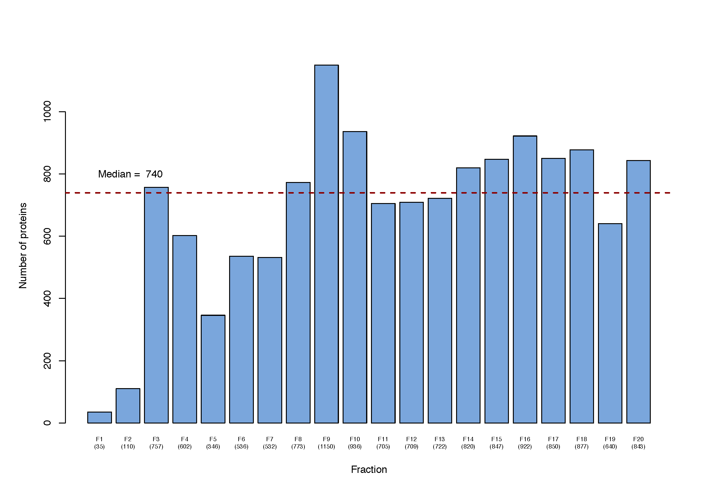

<style type="text/css">
h1.title {
  font-size: 38px;
  color: DarkBlue;
  text-align: center;
}
h4.author { /* Header 4 - and the author and data headers use this too  */
    font-size: 18px;
  font-family: "Times New Roman", Times, serif;
  color: Green;
  text-align: center;
}
h4.date { /* Header 4 - and the author and data headers use this too  */
  font-size: 18px;
  font-family: "Times New Roman", Times, serif;
  color: DarkRed;
  text-align: center;
}
</style>

\newpage
```{r global_options, echo=FALSE}
knitr::opts_chunk$set(fig.width=8,fig.height=6,fig.pos="H",warning=FALSE, message=FALSE,tidy = TRUE,tidy.opts=list(width.cutoff=50))
```

##Introduction
The objective of this analysis was to assess the potential for label-free proteomics experiments to identify RNA Binding Proteins (RBPs) in various cellular organelles.  

## 1. Primary Dataset
The primary dataset is from a very early experiment exploring RBPs following the Orthogonal Organic Phase Separation (OOPS) protocol. Briefly, U2OS cells were lysed, UV cross-linked at 254nm, dosage 400mJ/cm2 and then passed through an iodixanol gradient to yield 20 fractions. Each of these fractions were put through the OOPS protocol. The interphase for each of the 20 fractions was extracted and analysed using mass spectrometry to yield protein abundances. 

###a. Caveats
The current OOPS protocol involves three cycles of "washing" of the interphase containing RNA-bound proteins prior to release of proteins using RNAse. However, there were some caveats to this early version of OOPS.  
1. Only 2 trizol-wash steps were performed rather than the standard three making the results a little noisy  
2. The input volume of cells was greater than is ideal for the centrifuge so the first OOPS wash wasn't as efficient  
3. RNAse wasn't added to the last step so there is a chance of some floating contaminating RNA  

###b. Numbers of proteins
Given the small amounts of protein in early (low density) fractions and the caveats in the protocol the numbers of proteins obtained were highly variable across fractions 1-20 (F1...F20 hereafter) with very few proteins in F1 and F2. We obtained a total of 2140 unique proteins across the 20 fractions with the median number being 740 proteins per fraction. of these, 289 were glycoproteins which are a potential artefact of the experimental process and hence have been removed from downstream analysis. Finally, of the remaining 1851 proteins, only 936 had been previously reported as RBPs so we restricted downstream analyses to this set.   

###c. Organellar separation  
  
Our main question was whether we would be able to obtain organellar separation using these data. The short answer is yes. To work this out, we mapped proteins whose locations had been determined in previous experiments onto our dataset. Then, we plotted line graphs depicting changes in abundance across fractons. From the profile plots, we have clear resolution for ER, Mitochondria, Nucleus, Nucleus-Chromatin, Ribosome 40S and 60S. Golgi and Lysosome to a lesser extent.These assignments agree closely to the Western blots that were run on the fractions prior to Mass spectrometry analysis While the resolution is not as fantastic as it would be had the same cells been put through a full Localisation experiment, there is still enough to give us confidence that we are pulling down some, if not all, bonafide RNA-binding proteins.


+---------------+---------------+-----------------+--------------------+--------------------+
| Organelle     | Range         | Peak            | No. of markers     |Agrees with Western |
+===============+===============+=================+====================+====================+
| Cytosol       | F15-F20       | F18             | 10                 | Yes                |
+---------------+---------------+-----------------+--------------------+--------------------+
| ER            | F3-F5,F7-F11  | F9              | 14                 | Yes                |
+---------------+---------------+-----------------+--------------------+--------------------+
| Mitochondria  | F8-F11        | F9              | 17                 | Yes                |
+---------------+---------------+-----------------+--------------------+--------------------+
| Nucleus       | F13-F16       | F14             | 29                 | Partially          |
+---------------+---------------+-----------------+--------------------+--------------------+
| Nuc-Chromatin | F12-F15       | F14             | 13                 | Partially          |
+---------------+---------------+-----------------+--------------------+--------------------+
| PM            | F8-F11        | F9              | 17                 | NA                 |
+---------------+---------------+-----------------+--------------------+--------------------+
| Ribosome 40S  | F15-F19       | F16             | 20                 | NA                 |
+---------------+---------------+-----------------+--------------------+--------------------+
| Ribosome 60S  | F15-F19       | F16             | 32                 | NA                 |
+---------------+---------------+-----------------+--------------------+--------------------+

##2. Total Organellar Proteome
Having established that label-free OOPS was a feasible way of assigning proteins to organelles, albeit at a lower resolution, we looked for the impact that UV-crosslinking had on separating RNA-bound proteins into their expected organelles. For this, we obtained a separate dataset where U2OS cells were lysed and put through an iodixanol gradient with 20 fractions being collected. These fractions were followed up with a mass spectrometry analysis without an OOPS step.Theoretically, without OOPS, we should obtain proteins that are in organelles irrespective of whether or not they are bound to RNA. In other words, this would be the total organellar proteome. The localisation plots for the total organellar proteome are more robust and contains 5 times more proteins than the RNA-bound organellar proteome which is expected.  


##3. Comparison of the RNA-bound proteome to the total proteome
Remembering that the primary experiment included cell treatment with UV and the total proteome experiment didn't, we wanted to see if UV-crosslinking was key to enabling RBPs to be trafficked to the compartments where they are required by the cell.  

While the experiments from sections 1 and 2 above were not run in parallel from the same source of cells/fractions, we thought it would be worth comparing known sets of RBPs between them. If a difference were to be seen, we would then re-do these experiments in parallel to enable a more direct and relevant comparison.

### a. Bonafide RNA binding proteins
While we had >2000 RBPs from our primary experiment, we chose to keep just 936 proteins that were found in one or both published RNA binding protein studies in human cell lines. These were (1) [**Queiroz et al in U2OS cells**](https://www.nature.com/articles/s41587-018-0001-2#Sec10) (2) [**Trendel et al in HeLa, MCF7 and HEK293**](https://www.sciencedirect.com/science/article/pii/S0092867418314636?via%3Dihub).

### b. Interpreting plots
For the next few sections, you will see two-panel plots comparing RBP and total protein profiles for various protein groups. This section is to help you interpret them. In each plot, the top panel titled "RBP" refers to protein profiles from our promary study of UV-crosslinked, OOPS'd proteins. The bottom panel titled "Total.protein" refers to non-crosslinked, non-OOPS's total protein profiles. Each line is a protein. In cases where there are only a handful of proteins, each protein is coloured differently. Where there are 10s of proteins, the RBP is coloured in red and the Total.protein in blue. The little "x" marks represent the most abundant value (maxima) for each protein. A pile-up of 'X' symbols over a certain fraction indicate that that class of proteins is preferentially cound in the organelle that corresponds to that fraction. In some cases, proteins can be found across more than one organelle.

As we would expect, more proteins are found in the total proteome than in the RBP study in most categories studied below. In these cases, only those proteins common to both RBP and Total protein are shown for the comparison. The legend for each plot tells you what kind of proteins you are looking at. 

### c. Paraspeckle proteins
The first set of RBPs we looked at were paraspeckle proteins. Paraspeckles are a subnuclear organelle named so because they were observed in the interchromatin space near to, yet distinct from, the nuclear speckles that are enriched in splicing factors. Paraspeckles are restricted to mammalian nuclei and are known to appear only upon differentiation of human cells i.e they are missing in embryonic stem cells.

Paraspeckles were of interest to us as several studies have shown that they not only contain specific proteins (PSCP1, NONO, SPFQ) but the sequestering of these proteins to paraspeckles is highly dependent on RNAs - particularly long non-coding RNA NEAT1. Thus, they make a model group of RNA binding proteins to study across our RBP and total proteome study. The list of paraspeckle proteins was obtained from **Table 1** of [__**Naganuma and Hirose, 2013**__](http://emboj.embopress.org/content/31/20/4020) by including all those in the section "Known paraspeckle proteins" and all Category 1A and 1B proteins (n = 9). 

Other than PSPC1, all others show maximal abundance in fractions F14-F16 which are nuclear fractions. This ties in with our expectation that paraspeckles are sub-nuclear and are sequestered there by RNAs. Furthermore, the same set of proteins in the total proteome experiment peak in F19 which is cytosolic suggesting that UV-crosslinking might have an important role in preserving the bond between RNA and protein which is essential for the correct targetting of this set of RBPs.   

### d. Actin cytoskeleton proteins
We performed a Gene Ontology (GO) enrichment analysis of proteins in each fraction of our study. A term of interest was "actin cytoskeleton" which seemed to be enriched in Endoplasmic Reticulum (ER) fractions F6-F7. This doesn't mean that this feature isn't present in the other fractions but it implies that in F6 & F7, it is present with significantly higher probability than expected by chance. Knowing that this term was enriched in F6/F7, we could extract the proteins that contributed to this enrichment. There were 19 of these proteins.

The actin cytoskeleton is part of the network of protein filaments in the cell that help maintain its structure and allow for movement of the cell. In the RBP study, the abundance of these proteins seems to peak at F9 which is on the border between the ER and Mitochondria.In the total proteome, these proteins have a peak earlier at F7.   

### e. Nucleoplasm proteins
There were 906 proteins uniquely defined as nucleoplasm loacted in the Human Protein Atlas. Of these,there were 95 proteins present in the label-free OOPS RBP dataset. A lot more (350) were found in the Total protein dataset but we only kept the 95 to make the comparison more readable. In the RBPs these proteins have a broad peak encompassing F13-F16 which is where we expect the nuclear fraction to be. In the total protein fraction, the peak is distinct at F13 and then at F20 - very different to the RBP peak.   

### f. PolyA-binding proteins (PABP) and Eukaryotic Initiation Factor Gamma (eIFG)
PolyA binding proteins are RNA-binding proteins that bind to the polyA tail of mature mRNA. PABP1 (PABPC1) promotes the recruitment of the small ribosomal subunit by binding to eIFG Two well known polyA binding proteins, PABPC1 and PABPC4 were present in the RBP dataset. PABPC1 binds the 3', polyA tail of mRNA and is known to shuttle between the nucleus and cytoplasm. PABP-C1 stimulates the translation of cellular polyadenylated mRNAs by enhancing 40S ribosome subunit recruitment and 60S subunit joining. In keeping with the role of PABP, we see two peaks - one in the ER/Mitochondrial fraction (F9) and one in the cytoplasmic fraction pertinent to ribosomes (F16). Both PABP and EIFG follow a very similar profile. 

In the Total protein profiles, PABP proteins have a cytosolic peak but no ER/Mito peak. Additionally, EIFG does not have the same profile as the PABP proteins. This indicates to us that PolyA binding proteins readily attach to polyA tracts in mRNA without the need for UV-crosslinking to enhance the binding efficiency. However, the initiation factor 4G which also binds mRNA might need UV-light to secure the bond that keeps them in their destination organelles.   

### g. Other translation initiation factors
Having looked at EIF4G, we were curious to look at the profiles of other translation initiation factors in the RBP and total proteomes. We found 23/48 known EIFs in the RBP dataset and these are plotted in the comparison below. Like EIF4G, the primary peak is F16 where we expect ribosome associated proteins to be. A handful of proteins (eg: EIF4G1/2, DENR, EIF4B) also have minor peaks at F9 in the ER zone. In the total proteome, the peak seems to be at F15 which is more nuclear. 

### f. Translation elongation factors
Since translation happens in the cytoplasm, we expect to see these in F15-F19. Of 14 proteins known to be involved in translation elongation, 8 were found in the RBP dataset and are presented in the comparison plot. GFM and TUFM are mitochondrial translation elongation proteins that that is exactly where we find them in the UV-crosslinked data. With the other elongation factors, we find them scattered across the cytosolic fractions which is what we expect to see. In the total proteome, elongation factors seem to cluster in F14 which is the nuclear fraction.   

### g. Translation termination and ribosome recycling
To complete our view of RNA-binding proteins involved in translation, we looked at translation termination and ribosome recycling factors. Of these we could only find GSPT1 (termination factot) and ABCE1 (ribosome recycling factor) in our RBP dataset. The first peaks at F16, our ribosomal fraction while the recycling factor ABCE1 has several smaller peaks and isn't too different from what is seen in the total proteome. ABCE1 itself doesn't bind any RNA so it is not surprising that the profile we see is very similar between the RBP and total proteome studies.    

### h. Ribosomal proteins. 
The final category we chose to look at was ribosomal proteins in both the 60s (large) and 40s(small) eukaryotic ribosomal subunits. We found 38 large subunit and 25 small subunit proteins in our RBP dataset. For both sets of proteins, the peak in both RBP and total proteome is F16/F17 which are where we expect ribosomes to be. In addition to this, the total proteome shows a secondary peak ("hump") at F7 which is in the ER zone. This could be indicative of ribosomes that have not yet exited through the translocon into the cytoplasm.    
  

## Conclusions
Over the assessment of several categories of proteins between UV-crosslinked RNA-bound proteins and the Total proteome, it appears that the crosslinking is essential to confidently identify true RBPs. This was a comparison between two independent experiments and ideally, they would be done in parallel on the same samples by splitting the starting material between the two experimental types. Plans for a more closely comparable experiment are underway but in the meantime, all future experiments involving RBP localisation (both for RNA and protein species) will be performed in UV-crosslinked cells. 

