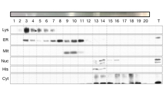
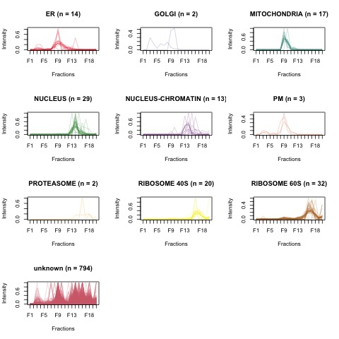

<style type="text/css">
h1.title {
  font-size: 38px;
  color: DarkBlue;
  text-align: center;
}
h4.author { /* Header 4 - and the author and data headers use this too  */
    font-size: 18px;
  font-family: "Times New Roman", Times, serif;
  color: Green;
  text-align: center;
}
h4.date { /* Header 4 - and the author and data headers use this too  */
  font-size: 18px;
  font-family: "Times New Roman", Times, serif;
  color: DarkRed;
  text-align: center;
}
</style>

---

```{r global_options, echo=FALSE}
knitr::opts_chunk$set(fig.width=8,fig.height=6,fig.show='hold',warning=FALSE, message=FALSE,tidy = TRUE,tidy.opts=list(width.cutoff=50))
```

##Introduction
This dataset is the first quick-LOPIT experiment exploring RBPs following the OOPS protocol. Given the small amounts of protein in some LOPIT fractions, the aim is to work out if a Label-free quantitation is a feasible way of analysing these proteins. Labelling with TMT requires that all fractions be scaled down to the lowest one and hence can compromise a full exploration of proteins. 

There are some caveats to this experiment (1) It was the first of its kind (2) only 2 trizol-wash steps were performed rather than the standard three making the results a little noisy (3) RNAse wasn't added to the last step so there is a chance of some floating contaminating RNA (4) Input volume was greater than ideal so first wash wasn't as efficient.

However, it is worth looking at the data as it stands to see if it can provide any insights that TMT-labelled data cannot.

In the following lines of code, we will:  
 1. Look at the peptide-level raw data  
 2. Filter data to remove those mapping to multiple proteins  
 3. Imputing missing values   
 4. Aggregate the data into protein-level quantification  
 5. Filter the data to remove contaminants  
 6. Transform data to MSnSets and use those to analyse data
 7. Try and classify unknown proteins based on known profiles 
 8. Look for functionally unifying themes across the 20 fractions
 9. Validate findings using an independent dataset (LORNA)
 
***
##Startup    
We start by installing and loading the libraries required for our analysis. Additionally, tell R where you are running your program by setting your working directory as shown below using the variable 'wd'. We will use this later on. Also make your input and output directories (indir/outdir) as shown below.

```{r 00_Startup, eval=T, echo = T, cache=F}
suppressMessages(library(reshape2))
suppressMessages(library(ggplot2))
suppressMessages(library(ggsci))
suppressMessages(library(dplyr))
suppressMessages(library(MSnbase))
suppressMessages(library(ggbiplot))
suppressMessages(library(pRoloc))
suppressWarnings(library(mygene))
suppressWarnings(library(data.table))
suppressWarnings(library(patchwork))

#Setting working directories
# Note: Change the next line of card to point to your working directory
wd = "~/Documents/Work/TTT/02_Proteomics/15_OOPS-Label-Free-RBPs/OOPS-label-free/"
setwd(wd)
#getwd()

# Declaring input and output directories
indir = paste(wd,"Input",sep="/")
outdir = paste(wd,"Output",sep = "/")
plotdir = paste(wd,"Plots",sep="/")

# If output and plots directory exist, clear them out and start afresh
if (exists(outdir)){
  system(paste0("rm -r",outdir))
}
if (exists(plotdir)){
  system(paste0("rm -r",plotdir))
}

dir.create(outdir)
dir.create(plotdir)

```
##01. Read in the peptide-level quantification (Raw data)
We'll start by reading the peptide-level quantification data into a dataframe. If we take a look at the colnames of the `peptides` dataframe, we can see we have 56 columns. We'll filter these to only keep the ones that are potantially useful to us. The first 12 columns describe the sequence of the peptide, the modifications which were detected and the protein which the peptide has been assigned to. Columns 13-32 indicate whether a given protein was found in the fraction or not.Columns 33-52 provide the quantification values for the 20 fractions of samples that have gone through qLOPIT followed by OOPS.The last 4 columns indicate the confidence of protein assignment across different algorithms used for peak identification. 

Of these columns, we keep 4 information columns (Sequence, Modifications, Number.of.Proteins, Master.Protein.Accessions) and all area-under-the-curve value columns (33-52). 

```{r 01_ReadingData}
peptides <- read.table(paste(indir,"OOPS_qLOPIT_LabelFree_PeptideGroups.txt",sep="/"), sep="\t", header=T,stringsAsFactors = F)
#colnames(peptides)
#head(peptides[,c(3:4,8,10,33:52)])

# Keeping only those that are of use for downstream analysis
peptides_quant = peptides[,c(3:4,8,10,33:52)]
colnames(peptides_quant) = gsub(".Sample","",gsub("Area.","",colnames(peptides_quant)))
dim(peptides_quant)
#View(peptides_quant)

# How many peptides in each fraction
missing = colSums(is.na(peptides_quant[,5:24]))
peptide.nums = nrow(peptides_quant)-missing

# Plot missing/value fractions
t = cbind("Peptides"=100*peptide.nums/nrow(peptides_quant),"Missing"=100*missing/nrow(peptides_quant))
tmelt = reshape2::melt(t)
colnames(tmelt) = c("Fraction","Type","Percentage")

gmiss = ggplot(tmelt, aes(Fraction,Percentage))
gmiss = gmiss+geom_bar(stat = "identity", aes(fill = Type))+ scale_fill_jco() + geom_hline(yintercept=mean(t[,2]),colour="#CD534CFF",size=1)+labs(title="Missing-values-raw-data") + theme(plot.title = element_text(hjust = 0.5),axis.text.x = element_text(angle = 90, hjust = 1),legend.position="none") 

```


##02. Removing multi-map proteins
The "Number.of.Proteins" column in `peptides_quant` tells us how many proteins each peptide has mapped too. We can see that 22598 (78%) out of 29067 peptides map uniquely to one protein while the rest don't. We will filter to remove these multi-mappings as it makes the data less reliable. In addition, we remove proteins that don't have a mapping to a Uniprot ID (column = Master.Protein.Accessions) as we cannot do much downstream analysis without the IDs.

```{r 02_Removing-multiple-mappings}

table(peptides_quant$Number.of.Proteins)

# Remove non-unique peptide mappingsand those missing Master Protein assignments
pep.uniq = peptides_quant %>%
            filter(Number.of.Proteins == 1 & Master.Protein.Accessions != "")

pep.uniq = data.frame(pep.uniq)

dim(peptides_quant)
dim(pep.uniq)

# Loss
non.uniq.perc = 100*(nrow(peptides_quant) - nrow(pep.uniq))/nrow(peptides_quant) # 22.3%

# Re-draw the missing value plots for the filtered data
miss.uniq = colSums(is.na(pep.uniq[,5:24]))
miss.rows = rowSums(is.na(pep.uniq[,5:24]))
uniq.nums = nrow(pep.uniq)-miss.uniq

# Plot missing/value fractions
t.uniq = cbind("Peptides"=100*uniq.nums/nrow(pep.uniq),"Missing"=100*miss.uniq/nrow(pep.uniq))
t.uniq.melt = melt(t.uniq)
colnames(t.uniq.melt) = c("Fraction","Type","Percentage")

guniq = ggplot(t.uniq.melt, aes(Fraction,Percentage))
guniq = guniq+geom_bar(stat = "identity", aes(fill = Type))+ scale_fill_jco() + geom_hline(yintercept=mean(t.uniq[,2]),colour="#CD534CFF",size=1)+labs(title="Missing-values-after-multimap-removal") + theme(plot.title = element_text(hjust = 0.5),axis.text.x = element_text(angle = 90, hjust = 1))

# Print to file
pdf(paste(plotdir,"Fraction-of-missing-values.pdf",sep="/"),paper="a4r",width=12,height=8)
print(gmiss+guniq)
dev.off()
```
 

The left-hand plot above shows what percentage of peptides have values (blue) and what percentage are missing (yellow) for each of the 20 fractions. The red dotted lines shows the average %Missing which is ~85%. This means that on average, each fraction has values for 15% of total peptides captured across all fractons. After removing multi-mapped peptides, the average missing fraction remains the same and we haven't lost a large number of proteins (visible changes in F2, F6).

##03. Imputing missing values

As you can see in the plots above, there are a lot of missing values per sample and if we do want to impute (extrapolate) some of them, we have to remove those that are missing across all fraction (at least majority of them).The paper https://pubs.acs.org/doi/pdf/10.1021/acs.jproteome.5b00981 indicates that it is always better to impute at the peptide level and then aggregate into proteins. Having gone through the steps of imputation (for both random and non-random missing values) it became apparent that we retain more proteins without imputation. This is because we have to remove huge chunks of data to be able to impute missing values in the first place. 

An alternative to imputing values given how "lossy" the process is, is to keep all peptides and proceed with aggregating them into proteins in the hope of recovering more proteins than we did before. This also enables us to capture proteins across all fractions. Given this is a a label-free experiment, each fraction is a separate experiment so it is useful to see what we get by aggregating first without imputing. 

##04. Aggregating non-imputed data

We will merge AUC values for multiple peptides belonging to the same protein into one value per sample. We use the function 'summarize_all' in dplyr to do this. We add abundances across all peptides for a given protein.

```{r 04_Aggregating-non-imputed-data}

suppressMessages(library(dplyr))

prot.dat = pep.uniq %>%
    dplyr::group_by(Master.Protein.Accessions) %>%
    dplyr::select(F1:F20) %>%
    dplyr::summarise_all(sum,na.rm=T) %>%
    data.frame()

dim(prot.dat) # n = 2276
prot.dat = prot.dat[,c(1:5,7,6,8:21)]
```
After aggregating, we do want to remove all proteins where despite the aggregation, there is no abundance value for any of the fractions. We will count up how many such proteins exist by counting up the zeroes in each row. We will remove all rows where there are only zeroes for all 20 fractions. Consider this a simple filtering step post aggregation.
```{r}

# Counting zero abundances and removing all zero rows
# 82 such rows/proteins exist and are removed
table(rowSums(prot.dat[,2:21] == 0))
prot.dat =  prot.dat[-which(rowSums(prot.dat[,2:21] == 0) == 20),]
dim(prot.dat) # n = 2194

# How many proteins are retrieved in each fraction?
prot.counts = nrow(prot.dat) - colSums(prot.dat==0)[-1]
bp.names = paste(names(prot.counts),paste("(",prot.counts,")",sep=""),sep='\n')

pdf(paste(plotdir,"Barplot-of-protein-counts-across-fractions.pdf",sep="/"),paper="a4r",width=12,height=8)
barplot(prot.counts,names.arg = bp.names,cex.names = 0.6,col="#7AA6DCFF", ylab="Number of proteins", xlab="Fraction")
abline(h = median(prot.counts),col="darkred",lty=2,lwd=2)
text(2,800,paste("Median = ",round(median(prot.counts)[1],0)))
dev.off()
```
  


As you can see from the plot above, there is a wide range of protein numbers across the 20 fractions with F1 and F2 being the least protein rich and F9, F10, F15 being highest in protein numbers. The red dotted line shows the median number of proteins across the fractions which is 740 proteins. The mean is 686 proteins if you are interested to know.

##05. Further filtering
We haven't yet filtered for common proteomics "contaminants" such as proteins from hair, nail etc. There are a few ways of removing these.    
a. Some are annotated by the prefix "cRAP"  
b. Some map to non-human proteins. Given these are U2OS cells, we expect all to be human.   
c. Some overlap with our `contam.txt` file  
d. Finally, there are glycoproteins that appear in our list of RNA-binding proteins. We want to flag them to give us the option of removing them from downstream analyses.  

```{r 05_Further-filtering}
# Make a copy of prot.dat in case you over-write it 
store.dat = prot.dat
dim(store.dat) # n = 2194

# 5a: Remove 'cRAP' proteins
rownames(prot.dat) = prot.dat$Master.Protein.Accessions
prot.dat = prot.dat[grep("cRAP",prot.dat$Master.Protein.Accessions,invert=T),] # Removing proteins annotate as cRAP in the list
dim(prot.dat) # n = 2187

# Obtaining more protein-level information from Uniprot
# This list is uploaded to Uniprot and the additional annotations are downloaded from Uniprot. https://www.uniprot.org/uploadlists/ 
# Of 2187 proteins, 2149 are human; rest to various other species.
write.table(prot.dat,paste(indir,"Aggregated-proteins-2187-for-Uniprot.txt",sep="/"),sep="\t",row.names=F,quote=F)

# Reading in additional annotations from Uniprot
uniprot.info = read.delim(paste(indir,"Aggregated-proteins-2187-with-uniprot.tab",sep="/"),sep="\t",header=T,stringsAsFactors = F)
rownames(uniprot.info) = uniprot.info$Entry
colnames(uniprot.info)[1] = "Query"
#sort(table(uniprot.info$Organism))

# 5b. Remove non-human proteins
non.human = uniprot.info[grep("Human",uniprot.info$Organism,invert = T),"Query"]
non.human.prots = prot.dat[non.human,]
prot.dat = prot.dat[-which(prot.dat$Master.Protein.Accessions %in% non.human),]
dim(prot.dat) # n = 2221

# Merge prot.dat with uniprot information
human.rbps = merge(uniprot.info,prot.dat,by.x = "Query", by.y = "Master.Protein.Accessions", all.x = F, all.y=T)

# 5c. Remove any additonal contaminants based on the contamination file
contam = read.table(paste(indir,"contam.txt",sep="/"),sep="\t",header=F)

final.rbps = human.rbps[-which(human.rbps$Entry.name %in% contam$V1),]
rownames(final.rbps) = final.rbps$Entry
dim(final.rbps) # n = 2140

# How many proteins in each fraction ?
colSums(final.rbps[9:28] != 0)

# 5d. Add glycosylation information
final.rbps$is.glyco = FALSE
final.rbps$is.glyco[which(final.rbps$Glycosylation != "")] = TRUE
glycomelt = melt(final.rbps[,c(1,9:29)]) %>% 
              filter(value != 0) # Only include those proteins that have an abundance value

# Count of proteins that are glycoproteins
glycocount = as.data.frame.table(table(glycomelt$variable, glycomelt$is.glyco))
colnames(glycocount) = c("Fraction","is.glyco","Count")

# Percentage of proteins that are glycoproteins
glycoperc = as.data.frame.table(100*table(glycomelt$variabl, glycomelt$is.glyco)/rowSums(table(glycomelt$variabl, glycomelt$is.glyco)))
colnames(glycoperc) = c("Fraction","is.glyco","Percentage")
glycoperc$is.glyco = factor(glycoperc$is.glyco, levels = c("TRUE","FALSE"))

# Plot barplot
suppressMessages(library(scales))
glycobar = ggplot(glycoperc,aes(fill=is.glyco,y=Percentage, x=Fraction)) + geom_col(position="fill")+scale_y_continuous(labels=percent_format())

# How many RBPs do we have in total
dim(final.rbps)

pdf(paste(plotdir,"Glycoproteins-in-fractions.pdf",sep="/"),paper="a4r",width=12,height=8)
glycobar + labs(title="Percentage of RBPs that are glycoproteins in each fraction") + theme(plot.title = element_text(hjust = 0.5)) 
dev.off()
```
    

There seem to be more glycoprotein RBPs in the earlier than in the latter fractions which corresponds to glycoproteins being more present in the Lysosomic/ER/Mitochondrial fraction. From a starting number of 2276, we now have 2140 proteins after filtering out contaminants. We are now interested in what these proteins are and if they show any association with the subcellular localisation that each fraction is linked to. We have performed Western Blot experiments using known localisation markers and we hope to see proteins in the fractions correlate to this blot. 

## 06. Working with MSnSets
An MsnSet is an object that is used as part of the MSnbase package. It helps explore protein localisation data which is what we have. It is based largely on the ExpressionSet which was an object created to analyse microarray gene expression datWestern-blot.jpega. 

### 6a. Creating an MSnSet
An MSnset contains 3 main slots - 'exprs' which contains protein abundance values, 'fData' which contains feature data or information about each protein the the dataset and 'pData' or phenotypic data which contains information about the samples (fractions) being studied using mass spectrometry.
```{r 6a_Creating-an-MSnSet}

head(final.rbps)
rownames(final.rbps) = final.rbps$Query

# Filling in the three slots 
dat = final.rbps %>% dplyr::select(F1:F20) %>% as.matrix()
fd = final.rbps %>% dplyr::select(Query:is.glyco)
pd = data.frame("samples"= colnames(dat))
rownames(pd) = pd$samples
```
  


```{r}
# Based on Western blot above
pd$Organelle = c("unknown","Lysosome","Lysosome+someER","Lysosome+someER","Lysosome+someER","Lysosome+someER","Lysosome+ER","ER","ER+Mitochondria","ER+Mitochondria","ER+someMitochondira","Cytoplasm","Nucleus+Histone+Cytoplasm","Nucleus+Histone+Cytoplasm","someNucleus+Cytoplasm","someNucleus+Cytoplasm","Cytoplasm","Cytoplasm","Cytoplasm","Cytoplasm")

# We will add a bit more information to the fData file 
# 1. List of known RBPs across cell lines in the XRNAX paper (Table S2)
xrnax = read.delim(paste(indir,"xrnax-genelist.txt",sep="/"),sep="\t",header=T)
xrnax.rbps = xrnax %>% 
              dplyr::filter(!is.na(MCF7.RBP) | !is.na(HEK293.RBP) | !is.na(HeLa.RBP)) %>% 
              dplyr::select(Uniprot.ID:Protein.name)
rownames(xrnax.rbps) = xrnax.rbps$Uniprot.ID

# Check how many are common to the cell lines in the XRNAX paper
xrnax %>% 
  dplyr::select(MCF7.RBP:ihRBP) %>%
  apply(2, table,useNA="always")

# 2. List of RBPs from SILAC experiments using OOPS after wash step2 (Table S1)
oops = read.delim(paste(indir,"oops-genelist.txt",sep="/"),sep="\t",header=T)
oops.rbps = oops %>% 
              dplyr::filter(step == 2 & CL_NC_Ratio >= 1.0) %>% 
              dplyr::select(master_protein, RBP_glyco)
rownames(oops.rbps) = oops.rbps$master_protein

# fData file augmentation
#head(fd)
fd$xrnax = FALSE
fd$xrnax[which(fd$Query %in% xrnax.rbps$Uniprot.ID)] = TRUE
fd$oops = FALSE
fd$oops[which(fd$Query %in% oops.rbps$master_protein)] = TRUE

# MsnSet creation 
# with and without glycoproteins and filtering for high confidence RBPs
rbps.res <- MSnSet(exprs = dat ,fData= fd ,pData = pd) # With glycoproteins, n = 2140
rbps.noglyc = rbps.res[which(fData(rbps.res)$is.glyco == FALSE)] # Without glycoproteins, n = 1851
rbps.highconf = rbps.noglyc[which(fData(rbps.noglyc)$xrnax == TRUE | fData(rbps.noglyc)$oops == TRUE)] # Verified as RBPS by XRNAX or OOPS and no glycoproteins, n = 936

# How many glycoproteins in each fraction?
#glycocount %>%
#  tidyr::spread(key = is.glyco,value=Count) %>% 
#  dplyr::collect()
```
We have created three MSnSets here - 'rbps.res' which contains all potential RBPs across 20 fractions and 'rbps.noglyc' where glycoproteins have been removed in each fraction. Numbers show that there are nearly 300 glycoproteins, majority of them in the early fractions. Remember that there is redundancy in the proteins in each fraction so the non-redundant count is 297. Finally, we have rbps.highconf which only contain those rbps found in the XRNAX study (HeLa,HEK293,MCF7) or OOPS study (U2OS) and are not known glycoproteins.

### 6b. Using MSnSets for Plotting and Normalisation

The plotting functons below currently only show maps for the high-confindence dataset. This can be changed to show the raw data by swapping the definition of "sets" and "setnames" to those that are commented out. The imputation step has been left out as there are too many missing values to add any value post-imputation. The data is sum-normalised which means that each row (each protein) is divided by the sum of the expression of that protein across all 20 fractions. This is helpful while viewing the data, particularly using Profile Plots as one can easily see where a given protein peaks in expression.  

```{r 6b_Using-MSnSets}

library(RColorBrewer)
my_palette <- colorRampPalette(c("yellow", "purple")) (n=20)

# Look at each MSnSet with various tools  
#sets = list(rbps.res,rbps.noglyc,rbps.highconf)  
#setnames = c("All.RBPs","RBPs.No.Glycoproteins","RBPs.Highconf.No.Glycoproteins")

sets = list(rbps.highconf)
setnames = c("RBPs.Highconf.No.Glycoproteins")
highconf.msnset = NULL

for(i in 1:length(sets)){
  
  # The dataset
  ds = sets[[i]]
  dim(ds)
  
  # Heatmap of raw data
  # Yellow = Missing; purple = Non-missing)
  pdf(paste(plotdir,"Heatmap-of-OOPS-label-free-data.pdf",sep="/"),paper="a4r",width=12,height=8)
  #heatmap(exprs(ds),Colv=NA,Rowv = NA,col = my_palette,labRow = NA, main = paste(setnames[i],"All data",sep = " : "))
  heatmap(exprs(ds),Colv=NA,Rowv = NA,col = my_palette,labRow = NA)
  dev.off()
  
  # Impute missing values if possible. 
  # Using NBAVG as it is from samples collected along a density gradient
  #ds = impute(ds,"nbavg")
  
  # Re-draw heatmap after imputation
  #heatmap(exprs(ds),Colv=NA,Rowv = NA,col = my_palette,labRow = NA, main = paste(setnames[i],"After NBAVG imputation",sep = " : "))
  
  # Add markers
  fData(ds)$markers <- NULL
  ds = addMarkers(ds,paste(indir,"FullHumanMarker.csv",sep="/"),mcol="markers")

  # Normalise data 
  ds2 = normalise(ds,"sum")
  
  # Profile plots with proLoc markers
  orgs = unique(sort(fData(ds2)$markers))
  cols = colorRampPalette(brewer.pal(9, "Set1"))(12)
  pdf(paste(plotdir,"Profile-plots-of-OOPS-label-free-data.pdf",sep="/"))
  #png(paste(plotdir,"Profile-plots-of-OOPS-label-free-data.png",sep="/"))
  par(mfrow=c(4,3))
  for(k in 1:length(orgs)){
    z = ds2[fData(ds2)$markers == orgs[k],]
    plotDist(z,ylim=range(exprs(z),na.rm=T),pcol = cols[k], lty=2,las=2)
    title(main = paste(orgs[k]," (n = ",nrow(z),")",sep=""),cex=0.8)
  }
  dev.off()
  
  # Necessary to plot 2D maps
  pdf(paste(plotdir,"PCA-plots-of-OOPS-label-free-data.pdf",sep="/"),paper="a4r",width=12,height=8)
  par(mfrow=c(2,2))
  plot2D(ds2, main = paste(setnames[i]," Dims 1:2",sep=""),fcol="markers",dims=c(1,2))
  plot2D(ds2, main = paste(setnames[i]," Dims 1:3",sep=""),fcol="markers",dims=c(1,3))
  plot2D(ds2, main = paste(setnames[i]," Dims 2:3",sep=""),fcol="markers",dims=c(2,3))
  plot2D(ds2,fcol="markers",dims=c(3,4),col="white")
  addLegend(ds2, fcol = "markers",where="center",cex=0.75)
  par(mfrow=c(1,1))
  dev.off()
  
  # Mark glycoproteins in the data if it hasn't been filtered out
  if(setnames[i] == "All.RBPs"){
    # Highlighting glycoproteins on plot fro all proteins only
    foi1 <- FeaturesOfInterest(description = "Glycoproteins",
                 fnames = fData(ds)$Query[which(fData(ds)$is.glyco == TRUE)])
    
    foi2 <- FeaturesOfInterest(description = "High-conf-RBPs",
                 fnames = fData(ds)$Query[which(fData(ds)$xrnax == TRUE | fData(ds)$oops == TRUE)])
    
    par(mfrow=c(1,1))
    plot2D(ds2, fcol = "markers",dims=c(1,2), main = "All RBPs with Glycoproteins marked")
    addLegend(ds2, fcol = "markers",
        where = "bottomright",
        cex = .7)
    highlightOnPlot(ds2, foi1,
          col = "black", lwd = 1, pch=4, cex=0.5)
    #highlightOnPlot(ds2, foi2,col = "purple",lwd = 1)
    #legend("topright", c("Glycoproteins", "High-conf-RBPs"),bty = "n", col = c("black", "purple"),pch = 1)
      legend("topright", c("Glycoproteins"),
         bty = "n", col = c("black"),
         pch = 4)
  }
  highconf.msnset = ds2
}
```
  

  

  

From the the PCA, we can see the separation of proteins along three axes : ER+Mitochondria, Nucleus+Nucleus-Chromatin,Cytosol+Ribosomes. From the profile plots, we have clear resolution for ER, Mitochondria, Nucleus, Nucleus-Chromatin, Ribosome 40S and 60S. Golgi and Lysosome to a lesser extent. 

From the highlighted Glycoproteins plot, it appears that glycoproteins are not present in the nuclear/cytosolic fractions but in the membranous fractions as well as the ER and Mitochondria.

## 07. Predicting classification for unknown markers
Knowing some markers, it can be useful to extrapolate to those proteins who don't have a cellular localisation. That's what we hope to achieve in this segment. However, we have a very small fraction of known markers so the prediction of the unknown might be a bit ropey. 

```{r 07_Classification-of-unknown-markers, echo=T, eval=F}

ds = addMarkers(rbps.res,paste(indir,"FullHumanMarker.csv",sep="/"),mcol="markers")
ds = normalise(ds,"sum")

w <- table(getMarkers(ds))
w <- 1/w[names(w) != "unknown"]

## 100 rounds of optimisation with five-fold cross-validation
#params <- svmOptimisation(sets[[i]],  fcol = "markers",times = 100, xval = 5,class.weights = w,fun=mean,na.rm=T)
#best = getParams(params) # sigma = 1; cost = 16

# Classify unknown markers
ds3 <- svmClassification(ds, cost = 16, sigma = 1, class.weights = w, fcol = "markers")
(ts <- orgQuants(ds3, fcol = "svm", scol = "svm.scores", mcol = "markers", t = .5))

## set point size of each protein to be inversely proportional to the
ptsze <- exp(fData(ds3)$svm.scores) - 1

## plot new predictions
par(mfrow=c(1,2))
plot2D(ds, fcol = "markers", cex = .7,dims=c(1,3))
plot2D(ds3, fcol = "svm", cex = ptsze,dims=c(1,3))
addLegend(ds3, fcol = "svm", where = "bottomright", bty = "n", cex = .7,ncol=2)

# get predicted values
ds3 <- getPredictions(ds3, fcol = "svm", scol = "svm.scores", mcol = "markers", t = ts)
plot2D(ds3, fcol = "svm.pred",cex = ptsze,dims=c(1,3))
addLegend(ds3, fcol = "svm", where = "bottomright", bty = "n", cex = .7,ncol=2)
  
  ## First remove the markers
preds <- unknownMSnSet(ds3)

## Plot a boxplot of the scores of each organelle
par(oma = c(10.5, 0, 0, 0)) ## sets outer margins
boxplot(svm.scores ~ svm, data = fData(preds),
         ylab = "SVM scores", las = 2)

plot2D(preds, fcol = "svm.pred",cex = ptsze,dims=c(1,3))

```

## 08. Functional enrichment analysis
Once we have identified proteins in each fraction with or without imputation, we'd like to see if each fraction is enriched for any functional groups. 

### 8a. Setting up the background for enrichment
For this, we use a list of ~ 7500 bonafide RNA-binding proteins defined in the U2OS cell line (the cell line in our study) from the [Geiger et al paper](https://www.mcponline.org/content/11/3/M111.014050). We then query the Interpro database to annotate this list with GO terms, interpro terms and KEGG pathways. Following this, we use the 'goseq' package and function to test enrichment using a Wallenius' hypergeometric test which where items in the hypergeometric distribution are sampled with bias. The bias term used here is the maximum abundance of each protein obtain by averaging the logged abundance values from 3 replicates in the Geiger et al paper.

```{r 8a_Enrichment-analysis-setting-up-background, eval=F, echo = T}

# Source functions
source("mcf10aFunctions.R")

# Background list
u2os.bg = read.delim(paste(indir,"U2OS_Background-list-of-proteins.txt",sep="/"),header=T,sep="\t",stringsAsFactors = F)
rownames(u2os.bg) = u2os.bg$master_protein

# Source functionsu
source("mcf10aFunctions.R")

# Building background of U2OS proteins from Geiger et al.
univ = u2os.bg$master_protein
univ.ann = myProtMapper(univ,out.fields=c("interpro.short_desc","ensembl.gene","go.MF.id","go.CC.id","go.BP.id","pathway.kegg"))
univ.ann$kegg.id = sapply(univ.ann$pathway.kegg, function(x) paste0(unique(unlist(x[[1]])),collapse=";"))
univ.ann$kegg.name = sapply(univ.ann$pathway.kegg, function(x) paste0(unique(unlist(x[[2]])),collapse=";"))

# Make mapping for goseq analysis
univ.cat.go = makeGene2Cat(univ.ann,"query","go.all",";") 
univ.cat.doms = makeGene2Cat(univ.ann,"query","domains",";")
univ.cat.kegg = makeGene2Cat(univ.ann,"query","kegg.name",";")

saveRDS(univ.cat.go,paste(indir,"UnivGO.rds",sep="/"))
saveRDS(univ.cat.doms,paste(indir,"UnivDOMS.rds",sep="/"))
saveRDS(univ.cat.kegg,paste(indir,"UnivKEGG.rds",sep="/"))

```
### 8b. Function for enrichment analysis of fraction data
This is the function we will be using repeatedly to analyse functional themes in our label-free data, if these exist. Ideally, we use all our data but can also perform analysis on glyco-protein free or high-confidence RBP data. 

```{r 8b_Function-for-enrichment-analysis}

#-------------------------------------------------------------------------------------------------
# Input :
#   channels = Samples/Fractions over which functional enrichment is required
#   data = The normalised protein abundance data to inform on which proteins to use for enrichment
#   suf = Suffix used for naming output files
#-------------------------------------------------------------------------------------------------

runEnrich<- function(channels,data,suf){
  
  source("mcf10aFunctions.R")
  
  # Read in Go/Interpro/KEGG information
  univ.cat.go = readRDS(paste(indir,"UnivGO.rds",sep="/"))
  univ.cat.doms =  readRDS(paste(indir,"UnivDOMS.rds",sep="/"))
  univ.cat.kegg =  readRDS(paste(indir,"UnivKEGG.rds",sep="/"))

  u2os.bg = read.delim(paste(indir,"U2OS_Background-list-of-proteins.txt",sep="/"),header=T,sep="\t",stringsAsFactors = F)
  rownames(u2os.bg) = u2os.bg$master_protein
  
  univ = u2os.bg$master_protein
  
  all.go = NULL
  all.pro = NULL
  all.kegg = NULL
  
  for(l in 1:length(channels)){
    prots = names(which(exprs(ds)[,l] != 0))
    go = rungoseq(prots,univ.cat.go,univ, b=u2os.bg$max, 0.05)
    pro = rungoseq(prots,univ.cat.doms,univ, b=u2os.bg$max, 0.05)
    kegg = rungoseq(prots,univ.cat.kegg,univ, b=u2os.bg$max, 0.05)
    
    # Save results  
    if(nrow(go[[2]])>0){
      all.go = rbind(all.go,cbind(Cluster=channels[l],go[[2]]))
    }
    if(nrow(pro[[2]])>0){
      all.pro = rbind(all.pro,cbind(Cluster=channels[l],pro[[2]]))
    }
    if(nrow(kegg[[2]])>0){
      all.kegg = rbind(all.kegg,cbind(Cluster=channels[l],kegg[[2]]))
    }
  }
  
  # Prepare data for plotting
  all.go$Description = paste("(",all.go$ontology,") ",all.go$term,sep="")
  all.pro$Description = all.pro$category
  all.kegg$Description = all.kegg$category
  
  # More preparation
  colnames(all.kegg)[3] = colnames(all.pro)[3] = colnames(all.go)[3] = "pvalue"
  all.kegg$Description = gsub(" \\- Homo sapiens \\(human\\)","",all.kegg$Description)
  all.go$Cluster = factor(all.go$Cluster, levels = as.character(channels))
  
  # Plots
  ego = enricherPlot(all.go,paste(suf,"All-GO-U2OS-Label-free",sep="_"),N=3,colorBy = "neg.log10.BH",sizeBy ="foldEnrich",low.col="#E69F00",high.col="#999999",trunc.len=40,all.size=10,y.size=8,x.size=8)
  epro = enricherPlot(all.pro,paste(suf,"All-Interpro-U2OS-Label-free",sep="_"),N=3,colorBy = "neg.log10.BH",sizeBy ="foldEnrich",low.col="#E69F00",high.col="#999999",trunc.len=40,all.size=10,y.size=8,x.size=8)
  ego.cc = enricherPlot(all.go[which(all.go$ontology == "CC"),],paste(suf,"GO-Cellular-component-U2OS-Label-free",sep="_"),N=4,colorBy = "neg.log10.BH",sizeBy ="foldEnrich",low.col="#E69F00",high.col="#999999",trunc.len=40,all.size=10,y.size=8,x.size=8)
  ego.mf = enricherPlot(all.go[which(all.go$ontology == "MF"),],paste(suf,"GO-Molecular-Function-U2OS-Label-free",sep="_"),N=4,colorBy = "neg.log10.BH",sizeBy ="foldEnrich",low.col="#E69F00",high.col="#999999",trunc.len=40,all.size=10,y.size=8,x.size=8)
  ego.bp = enricherPlot(all.go[which(all.go$ontology == "BP"),],paste(suf,"GO-Biological-Process-U2OS-Label-free",sep="_"),N=4,colorBy = "neg.log10.BH",sizeBy ="foldEnrich",low.col="#E69F00",high.col="#999999",trunc.len=40,all.size=10,y.size=8,x.size=8)
  ego.bp = enricherPlot(all.go[which(all.go$ontology == "BP"),],paste(suf,"GO-Biological-Process-U2OS-Label-free",sep="_"),N=3,colorBy = "neg.log10.BH",sizeBy ="foldEnrich",low.col="#E69F00",high.col="#999999",trunc.len=40,all.size=10,y.size=8,x.size=8)
  ekegg = enricherPlot(all.kegg,paste(suf,"All-KEGG-U2OS-Label-free",sep="_"),N=15,colorBy = "neg.log10.BH",sizeBy ="foldEnrich",low.col="#E69F00",high.col="#999999",trunc.len=40,all.size=10,y.size=8,x.size=8)
  
  pdf(paste(plotdir,paste(format(Sys.time(),"%Y-%m-%d_%H.%M.%S"),paste(suf,"GO-Interpro-enrichment-plots-for-U2OS-label-free-data.pdf",sep="_"),sep="_"),sep="/"),paper="a4r",width=12,height=8)
  print(ego)
  print(ego.cc)
  print(ego.mf)
  print(ego.bp)
  print(epro)
  print(ekegg)
  dev.off()
  
  return(list(all.go,all.pro,all.kegg))
}
```

### 8c. Testing functional enrichment
We will have to test a few different versions of RBPs across fractions
1. RBPs across the entire dataset
2. RBPs with glycoproteins removed
3. High-confidence RBPs with glycoproteins removed

```{r 8c_Enrichment-analysis, warning=F, message=F, echo = T}

# Running functional enrichment
library(goseq)

# Running enrichment for non-imputed, glycoprotein-containing samples
#channels = pData(rbps.res)$samples
#res.rbps.all = runEnrich(channels,rbps.res,"All-RBPs")

# Running enrichment for non-imputed, glycoprotein-free samples
#channels = pData(rbps.noglyc)$samples
#res.noglyc = runEnrich(channels,rbps.noglyc,"RBPs-Without-Glycoproteins")

# Running enrichment for high-confidence, glycoprotein-depleted samples
channels = pData(rbps.highconf)$samples
#res.rbps.highconf = runEnrich(channels,rbps.highconf,"RBPs-Highconf-Without-Glycoproteins")

# Checking how many proteins are in each fraction
# This is for verifying against the GO/Interpro runs. 
for(l in 1:length(channels)){
    prots = names(which(exprs(rbps.highconf)[,l] != 0))
    print(paste(l,length(prots),sep=" : "))
}

```
  


While the enrichment analysis works well, we aren't able to resolve each fraction into a particular cellular organelle based on GO/Interpro terms. This is relative to what we expect to see based on protein profiles and PCA plots. 

GO terms are a huge collection of annotations made using published scientific data. While it contains a lot of information, some GO terms can be biased as they are based purely on a handful (<5) studies. Furthermore, given the nature of our label-free experiments, the proteins in each fraction don't just comprise those at the peak of a given fraction but also those that are in the long tails of surrounding fractions. 

Perhaps an idea could be to narrow in on those proteins that have maximum abundance at a given fraction and re-run enrichment analyses on the smaller list.

### 8d. Printing results to file
The functional enrichment plots show just the top 3/4 terms for each fraction for each category - GO, KEGG, Interpro. To see the full list and to access identifiers from the list, we will print them to tab-delimited text files. The reordering is partly to enable us to see the data better in R and partly to print to file and avoid any Excel quirks when opened. 
```{r echo=T, eval=F}

all.go = res.rbps.highconf[[1]]
all.pro = res.rbps.highconf[[2]]
all.kegg = res.rbps.highconf[[3]]

# Re-order all.go and all.pro
#all.go[1:5,c(1:2,12,15,13,16,3,8:9,20,5:6,10:11,17)]
all.go.1 = all.go[,c(1:2,12,15,13,16,3,8:9,20,5:6,10:11,17)]
all.go.1$geneNames = sapply(all.go$geneID,function(x) paste(queryMany(strsplit(x,"/")[[1]],scopes="uniprot",fields = c("symbol"))$symbol,collapse="/"))

#all.pro[1:5,c(1:2,10,13,11,14,3,5:6,8:9,15)]
all.pro.1 = all.pro[,c(1:2,10,13,11,14,3,5:6,8:9,15)]
all.pro.1$geneNames = sapply(all.pro$geneID,function(x) paste(queryMany(strsplit(x,"/")[[1]],scopes="uniprot",fields = c("symbol"))$symbol,collapse="/"))

#all.kegg[1:5,c(1:2,10,13,11,14,3,5:6,8:9,15)]
all.kegg.1 = all.kegg[,c(1:2,10,13,11,14,3,5:6,8:9,15)]
all.kegg.1$geneNames = sapply(all.kegg$geneID,function(x) paste(queryMany(strsplit(x,"/")[[1]],scopes="uniprot",fields = c("symbol"))$symbol,collapse="/"))
all.kegg.1$category = gsub(" \\- Homo sapiens \\(human\\)","",all.kegg.1$category)

# Write to table
write.table(all.go.1,paste(outdir,"All-Enriched-GO-terms-U2OS-label-free.txt",sep="/"),sep="\t",row.names=F,quote=F)
write.table(all.pro.1,paste(outdir,"All-Enriched-Interpro-U2OS-label-free.txt",sep="/"),sep="\t",row.names=F,quote=F)
write.table(all.kegg.1,paste(outdir,"All-Enriched-KEGG-pathways-U2OS-label-free.txt",sep="/"),sep="\t",row.names=F,quote=F)
```
## 09. Validating OOPS-label free data with labelled LORNA/LOPIT data
Having looked at this data with Tom, Eneko and Rayner, we want to confirm that what we see isn't artefactual. We stick to just the rbps.highconf for this part of the exercise and will overlap a subset of proteins (cytoskeletal,paraspeckle, nucleoplasm, PolyA binding) with LORNA data which represents the total proteome to see if there is a difference in their abundance profiles.  
  

Based on the Western blot above, we expect  
1. the paraspeckle RBPs to be picked up the nuclear fractions (F13-F15)  
2. the cytoskeletal RBPs to show distinct and different profile to total protein  
3. nucleoplasm RBPs to be in the nuclear fractions (F13-F15)  
4. polyA-binding proteins to be ER/Mito & cytoplasmic in the RBP study and only cytoplasmic in the total protein study  
5. translation initiation, elongation and termination factors  

For the LORNA data, the columns names are the density of the gradient that Rayner/Enekp ran to separate the fractions. Note: Density 0.0948 is actually 0.9480. I've taken the column names, sorted with indexes and used the indices to re-roder the columns from F1-F20. Following this, I've renamed the columns F1-F20 to make them comparable to the label-free OOPS data. I've also normalised both datasets using "sum-normalisation" to make them comparable. No imputation was done on label-free OOPS due to vast swathes of missing data. 

### 9a. Gathering lists of protein markers
In this first section, we are putting together lists of markers that we want to check the profiles of. These include paraspeckle proteins, cytoskeletal proteins, nucleoplasm proteins, stress granule proteins, polyA-binding proteins and proteins involved in the initiation, elongation and termination of translation. Will try and provide references for all. 
```{r 9a_Validating-findings-with-LORNA, eval=F, echo=T}

# 9a. Gathering subsets of protein markers

# (i) Paraspeckle proteins
# These proteins are known to be RNA-binding with the target RNA being long non-coding (lncRNA) NEAT1 and NEAT2
paraspeck = read.delim(paste(indir,"paraspeckle-prots.txt",sep="/"),header=T,stringsAsFactors = F)
colnames(paraspeck) = c("Query","UniprotID","UniprotName","ProteinName","Organism","Length","GeneName","goCC")

# (ii) Cytoskeletal genes/proteins
# Read in list of proteins with GO annotations from the enrichment analysis above
go.prots = read.delim(paste(outdir,"All-Enriched-GO-terms-U2OS-label-free.txt",sep="/"),sep="\t",header=T,stringsAsFactors = F)
cytop = go.prots[grep("cytoskeleton",go.prots$Description),"geneID"] # present F6 and F7
cytog = go.prots[grep("cytoskeleton",go.prots$Description),"geneNames"] # present F6 and F7
cyto.prot = data.frame(cbind(UniprotID=c(strsplit(cytop[1],"/")[[1]],strsplit(cytop[2],"/")[[1]]),GeneName=c(strsplit(cytog[1],"/")[[1]],strsplit(cytog[2],"/")[[1]])))
cyto.prot = distinct(cyto.prot)

# (iii) Nucleoplasm proteins (from Human Protein Atlas)
# Subset to keep only those found in RBP study
#if (!requireNamespace("BiocManager", quietly = TRUE))
#    install.packages("BiocManager")
#BiocManager::install("hpar", version = "3.8")

library(hpar)
data(hpaSubcellularLoc)
sub = hpaSubcellularLoc %>% 
  filter(grepl("Nucleoplasm",GO.id),Reliability != "Supported",Reliability != "Uncertain") %>%
  dplyr::filter(grepl("Nucleoplasm",Approved)| grepl("Nucleoplasm",Enhanced)) %>% 
  dplyr::select(Gene:Reliability,Enhanced,Approved,GO.id) %>% 
  dplyr::mutate(GO.count = sapply(GO.id,function(x) length(strsplit(as.character(x),split = ";",fixed = T)[[1]]))) %>% 
  dplyr::filter(GO.count == 1)

np.uniprot = queryMany(as.character(sub$Gene),scopes="ensembl.gene",fields = c("symbol","uniprot"))
np.uniprot = np.uniprot[,c("query","symbol","uniprot.Swiss.Prot")]
colnames(np.uniprot) = c("EnsemblID","GeneName","UniprotID")
np.uniprot = data.frame(np.uniprot)


# (iv) PolyA binding proteins
# Downloaded by querying "PABP" in Uniprot and filtering for Reviewed + Human + 'Protein names'
pabp  = read.delim(paste(indir,"pabp-prots.txt",sep="/"),header=T,stringsAsFactors = F)
colnames(pabp)[1] = "UniprotID"
colnames(pabp)[6] = "GeneName"

# (v) Translation initiation factors
# Downloaded by querying the following in Uniprot
# keyword:"Initiation factor [KW-0396]" AND reviewed:yes AND organism:"Homo sapiens (Human) [9606]"
ti = read.delim(paste(indir,"translation-initiation.txt",sep="/"),header=T,stringsAsFactors = F)
colnames(ti)[1] = "UniprotID"
colnames(ti)[6] = "GeneName"

# (vi) Translation elongation factors
# Downloaded by querying the following in Uniprot
# keyword:"Elongation factor" AND reviewed:yes AND organism:"Homo sapiens (Human) [9606]"
te = read.delim(paste(indir,"translation-elongation.txt",sep="/"),header=T,stringsAsFactors = F)
colnames(te)[1] = "UniprotID"
colnames(te)[6] = "GeneName"

# (vii) Translation termination factors
# Downloaded by querying the following in Uniprot
# name:erf AND reviewed:yes AND organism:"Homo sapiens (Human) [9606]"
tt = read.delim(paste(indir,"translation-termination.tab",sep="/"),header=T,stringsAsFactors = F)
colnames(tt)[1] = "UniprotID"
colnames(tt)[6] = "GeneName"
tt = tt[grep("ERF",tt$GeneName,invert=T),]

# (viii) Stress granules
# Downloaded by querying the following in Uniprot
# "stress granules" AND reviewed:yes AND organism:"Homo sapiens (Human) [9606]"
sg = read.delim(paste(indir,"stress-granules.txt",sep="/"),header=T,stringsAsFactors = F)
colnames(sg)[1] = "UniprotID"
colnames(sg)[6] = "GeneName"

# (ix) Stress granules for U2OS from MSGP database
msgp =read.delim(paste(indir,"u2os-sg-uniprot.txt",sep="/"),header=T,stringsAsFactors = F)
colnames(msgp)[2] = "UniprotID"
colnames(msgp)[7] = "GeneName"

# (x) Golgi, PM and GAPDH proteins for Rayner
gpd = read.delim(paste(indir,"golgi-pm-gapdh.txt",sep="/"),header=T,stringsAsFactors = F)
colnames(gpd)[2] = "UniprotID"
colnames(gpd)[7] = "GeneName"

# (xi) p-body markers
pbody = read.delim(paste(indir,"pbody-xrn1.txt",sep="/"),header=T,stringsAsFactors = F)
colnames(pbody)[1] = "UniprotID"
colnames(pbody)[6] = "GeneName"

# (xii) late endosomes - JC paper 23.4.19
endo = read.delim(paste(indir,"late-endosomes.txt",sep="/"),header=T,stringsAsFactors = F)
colnames(endo)[2] = "UniprotID"
colnames(endo)[7] = "GeneName"

# (xiii) ribosome recycling
rr = read.delim(paste(indir,"ribosome-recycling.txt",sep="/"),header=T,stringsAsFactors = F)
colnames(rr)[2] = "UniprotID"
colnames(rr)[7] = "GeneName"

# (xiv) 60S ribosomal proteins
ribo60 = read.delim(paste(indir,"60s-ribosome.txt",sep="/"),header=T,stringsAsFactors = F)
colnames(ribo60)[1] = "UniprotID"
colnames(ribo60)[6] = "GeneName"

# (xv) 40S ribosomal proteins
ribo40 = read.delim(paste(indir,"40s-ribosome.txt",sep="/"),header=T,stringsAsFactors = F)
colnames(ribo40)[1] = "UniprotID"
colnames(ribo40)[6] = "GeneName"

```
The next step to the analysis is readying the RBP and total protein datasets to allow comparisons. For the RBP dataset, we are restricting this to those proteins annotated as RBP by XRNAX or OOPS study and are not glycoproteins.

```{r 9b_Preparing-RBP-and-total-protein-datasets}

# Adding known markers to raw dataset
# Sum normalising the data
raw.msnset = addMarkers(rbps.res,paste(indir,"FullHumanMarker.csv",sep="/"),mcol="markers")
raw.msnset = normalise(raw.msnset,"sum")

# Adding known markers to high-confidence dataset
# Sum normalising the data
highconf.msnset = addMarkers(rbps.highconf,paste(indir,"FullHumanMarker.csv",sep="/"),mcol="markers")
highconf.msnset = normalise(highconf.msnset,"sum")

# Reading in the total protein dataset and normalising by sum
# The headers are the density indices. Sort by this and re-order columns
total.prot = readRDS(paste(indir,"prot_res_20_fractions_imputed_markers.rds",sep="/"))
total.prot = normalise(total.prot,"sum")
hnames = sapply(strsplit(colnames(exprs(total.prot)),"CV."),"[[",1)
hnames[which(hnames == "0.0948")] = 0.9480
hnames
ind = sort(hnames,index.return=T)$ix
ind

# Re-organising the total.prot dataset using indices from above and 'melt' for plotting 
total.exp = data.frame(exprs(total.prot))
total.exp = total.exp[,ind]
colnames(total.exp) = paste("F",seq(1:20),sep="")
total.exp$Uniprot = rownames(total.exp)
total.exp.gat <- melt(total.exp,id.vars = 21, measure.vars = 1:20,variable.name="Fraction", value.name="Abundance",na.rm=T)
colnames(total.exp.gat)[1] = "UniprotID"
head(total.exp.gat)

# Profile plots of total proteome
pd.total = data.frame(Fraction = colnames(total.exp[1:20]),Density = sort(hnames))
rownames(pd.total) = pd.total$Fraction
new.total = MSnSet(exprs = as.matrix(total.exp[,1:20]),fData = total.exp,pData = pd.total)
new.total = addMarkers(new.total,paste(indir,"FullHumanMarker.csv",sep="/"),mcol="markers")

org.tot = unique(sort(fData(new.total)$markers))[-13]
cols = colorRampPalette(brewer.pal(9, "Set1"))(12)
#pdf(paste(plotdir,"Profile-plots-of-total-proteome-data.pdf",sep="/"))
png(paste(plotdir,"Profile-plots-of-total-proteome-data.png",sep="/"))
par(mfrow=c(4,3))
for(k in 1:length(org.tot)){
  z = new.total[fData(new.total)$markers == org.tot[k],]
  plotDist(z,ylim=range(exprs(z),na.rm=T),pcol = cols[k], lty=2,las=2)
  title(main = paste(org.tot[k]," (n = ",nrow(z),")",sep=""),cex=0.8)
}
dev.off()


# Melt the rbp raw dataset
rbp.raw.exp = data.frame(exprs(raw.msnset))
rbp.raw.exp$Uniprot = rownames(rbp.raw.exp)
rbp.raw.exp.gat = melt(rbp.raw.exp,id.vars = 21, measure.vars = 1:20,variable.name="Fraction", value.name="Abundance",na.rm=T)
rbp.raw.exp.gat$Abundance = log10(rbp.raw.exp.gat$Abundance+1)
colnames(rbp.raw.exp.gat)[1] = "UniprotID"
head(rbp.raw.exp.gat)

# Melt the rbp highconf dataset
rbp.exp = data.frame(exprs(highconf.msnset))
rbp.exp$Uniprot = rownames(rbp.exp)
rbp.exp.gat = melt(rbp.exp,id.vars = 21, measure.vars = 1:20,variable.name="Fraction", value.name="Abundance",na.rm=T)
rbp.exp.gat$Abundance = log10(rbp.exp.gat$Abundance+1)
colnames(rbp.exp.gat)[1] = "UniprotID"
head(rbp.exp.gat)

```

```{r 9c_Function-for-plotting-RBP-vs-Total-Protein-profiles}
#------------------------------------------------------------------------------------------------------
# Function  : plotCompareProfile
# Aim       : Draws protein profile plots from and RBP and total protein experiment side-by-side
# Input     : 
#           : rbp.dat = Normalised RBP data with at least 3 essential columns - uniprot id, 
#                        density fraction number and protein abundance
#           : total.dat = Normalised Total protein data with at least 3 essential columns - Uniprot (ID), 
#                        Fraction(density fraction number) and Abundance (normalised protein abundance)
#           : prot.list = List of proteins for which you want the comparison plots drawn. Format is table 
#                         with 'UniprotID' being default ID column. Include a 'GeneName' column if you 
#                         want to use it for plotting legends
#           : cl = which variable do you want to colour (cl) your graphs by? Default = Uniprot.ID
#           : gp = which variable do you want to use to group points on your graph? Default = UniprotID
#           : fc = which variable do you want to facet your graph by ? Default = "Class"
#           : suf = A name for the output file to say what data it is eg: paraspeckle
#           : print2pdf = logical indicating whether or not you want the plot to be put in a PDF file
#           : print2jpg = logical indicating whether or not you want the plot to be put in a JPG file

# Output    : a ggplot object containing profile plots for a set of proteins from RBP and Total-protein
#             (optional): A PDF or a PNG 
#-------------------------------------------------------------------------------------------------------

plotCompareProfile <- function(rbp.dat,total.dat,prot.list,suf,cl,gp="UniprotID",fc='Class',print2pdf=T,print2jpg=F){
  
  plot.data = rbind(cbind(rbp.dat[which(rbp.dat$UniprotID %in% prot.list$UniprotID),],Class="RBP"),cbind(total.dat[which(total.dat$UniprotID %in% prot.list$UniprotID),],Class="Total.protein"))
  
  # How many proteins from our dataset overlap with query list
  rbp.in = intersect(prot.list$UniprotID,rbp.dat$UniprotID)
  tot.in = intersect(prot.list$UniprotID,total.dat$UniprotID)
  
  # Print missing data
  print(paste("Number of ",suf," proteins in the RBP study = ",length(rbp.in),sep=""))
  print(paste("Number of ",suf," proteins in the Total protein study = ",length(tot.in),sep=""))
  
  # Only use those proteins common to both datasets
  final.prots = intersect(rbp.in,tot.in)
  plot.data = plot.data[which(plot.data$UniprotID %in% final.prots),]
  
  # Add gene names
  plot.data = merge(plot.data,prot.list[,c("UniprotID","GeneName")])
  
  # Create ggplot object
  gg = ggplot(data=plot.data, aes(x=Fraction, y=Abundance, colour=get(cl),group=get(gp))) + geom_line()+facet_wrap(~get(fc),scales="free_y", nrow=2)+labs(colour=paste0(suf,".prots"))
  
  # Add points of maximum attendance as default to the plot above
  highlight <- plot.data %>%
  dplyr::group_by(GeneName,Class) %>%
  dplyr::filter(Abundance == max(Abundance))
  
  # Add a geom_point() layer to the plot above showing maxima
  gg = gg+geom_point(data = highlight,aes(x=Fraction,y=Abundance),color="black",pch=4,size = 2)
  
  # Do you want plots?
  # Use JPG for large profile plots
  
  if(print2pdf){
    pdf(paste(plotdir,paste0(suf,".pdf"),sep="/"))
    print(gg)
    dev.off()
  }
  if(print2jpg){
    jpeg(paste(plotdir,paste0(suf,".jpg"),sep="/"))
    print(gg)
    dev.off()
  }
  return(gg)
}
```

```{r 9d_Calling-plotting-function-for-comparisons}

# Paraspeckle protein profiles
ggps = plotCompareProfile(rbp.exp.gat,total.exp.gat,paraspeck,"Paraspeckle",cl="GeneName",gp="UniprotID",print2pdf=T,print2jpg=F)

# Cytoskeletal proteins
ggcs = plotCompareProfile(rbp.exp.gat,total.exp.gat,cyto.prot,"Cytoskeletal",cl="Class",gp="UniprotID",print2pdf=T,print2jpg=F)
  
# PolyA binding protein profiles
ggpolya = plotCompareProfile(rbp.exp.gat,total.exp.gat,pabp,"PolyA-binding",cl="GeneName",gp="UniprotID",print2pdf=T,print2jpg=F)

# PABP + EIFG
pabp.eifg = rbind(pabp[-3,],ti[grep("EIF4G",ti$GeneName),1:6])
gg.pabp.eifg = plotCompareProfile(rbp.exp.gat,total.exp.gat,pabp.eifg,"PABP-EIFG",cl="GeneName",gp="UniprotID",print2pdf=T,print2jpg=F)

# Nucleoplasm proteins ggplot
ggnp = plotCompareProfile(rbp.exp.gat,total.exp.gat,np.uniprot,"Nucleoplasm",cl="Class",gp="UniprotID",print2pdf=T,print2jpg=F)

# Translation initiation factors
ggti = plotCompareProfile(rbp.raw.exp.gat,total.exp.gat,ti,"Translation-initiation",cl="GeneName",gp="UniprotID",print2pdf=T,print2jpg=F)
#+geom_line(data=ggti$data[which(ggti$data$GeneName == "EIF4G1" | ggti$data$GeneName == "EIF4G2"),],aes(x=Fraction,y=Abundance),color="black")

# Translation elongation factors
ggte = plotCompareProfile(rbp.raw.exp.gat,total.exp.gat,te,"Translation-elongation",cl="GeneName",gp="UniprotID",print2pdf=T,print2jpg=F)

# Translation termination factors
ggtt = plotCompareProfile(rbp.raw.exp.gat,total.exp.gat,tt,"Translation-termination",cl="GeneName",gp="UniprotID",print2pdf=T,print2jpg=F)

# Ribosome recycling proteins
gg.rr = plotCompareProfile(rbp.exp.gat,total.exp.gat,rr,"Termination-Recycling",cl="GeneName",gp="UniprotID",print2pdf=T,print2jpg=F)

# Termination and ribosome recycling
ttrr = rbind(tt,rr[,2:ncol(rr)])
gg.ttrr = plotCompareProfile(rbp.exp.gat,total.exp.gat,ttrr,"Ribosome-recycling",cl="GeneName",gp="UniprotID",print2pdf=T,print2jpg=F)

# P-body proteins
gg.pb =  plotCompareProfile(rbp.raw.exp.gat,total.exp.gat,pbody,"P-body",cl="GeneName",gp="UniprotID",print2pdf=T,print2jpg=F)
#+geom_line(data=gg.pb$data[which(gg.pb$data$GeneName == "EDC3" | gg.pb$data$GeneName == "EDC4"| gg.pb$data$GeneName == "XRN1"),],aes(x=Fraction,y=Abundance,color=GeneName))+scale_color_manual(values = c("#A3A500", "#E76BF3","#F8766D", "#00BFC4","#00BF7D"))
#pdf(paste(plotdir,paste0("P-body",".pdf"),sep="/"))
#gg.pb
#dev.off()

# Late Endosomes, lournal club paper
gg.endo =  plotCompareProfile(rbp.raw.exp.gat,total.exp.gat,endo,"Late-endosomes",cl="GeneName",gp="UniprotID",print2pdf=T,print2jpg=F)

enexly = endo[grep("endosome|lysosome|exosome",endo$Gene.ontology..cellular.component.),]
gg.enexly = plotCompareProfile(rbp.raw.exp.gat,total.exp.gat,enexly,"Endosome-exosomes\n-lysosomes",cl="GeneName",gp="UniprotID",print2pdf=T,print2jpg=F)


# 60S ribosomal proteins
gg.60s = plotCompareProfile(rbp.raw.exp.gat,total.exp.gat,ribo60,"60S-Ribosome",cl="Class",gp="UniprotID",print2pdf=T,print2jpg=F)

# 40S ribosomal proteins
gg.40s = plotCompareProfile(rbp.raw.exp.gat,total.exp.gat,ribo40,"40S-Ribosome",cl="Class",gp="UniprotID",print2pdf=T,print2jpg=F)

```

```{9e_Once-off-printing}
# Stress granules
ggsg = plotCompareProfile(rbp.raw.exp.gat,total.exp.gat,sg,"Stress-granule",cl="Class",gp="UniprotID",print2pdf=T,print2jpg=F)

# Cytoplasmic stress granules
csg = sg[grep("cytoplasmic stress granule",sg$Gene.ontology..cellular.component.),]
gg.csg = plotCompareProfile(rbp.raw.exp.gat,total.exp.gat,csg,"Cytoplasmic-Stress-granule",cl="Class",gp="UniprotID",print2pdf=T,print2jpg=F)
gg.csg

# U2OS stress granules from MSGP
gg.msgp = plotCompareProfile(rbp.raw.exp.gat,total.exp.gat,msgp,"Stress-granule-U2OS",cl="Class",gp="UniprotID",print2pdf=T,print2jpg=F)

# GAPDH, Golgi, PM proteins for Rayner
gg.gpd =  plotCompareProfile(rbp.exp.gat,total.exp.gat,gpd,"Golgi-PM-GAPDH",cl="GeneName",gp="UniprotID",print2pdf=T,print2jpg=F)

# Extracting Golgi, PM proteins for Rayner
rayner.prot = fData(highconf.msnset)[grep("GOLGI|PM",fData(highconf.msnset)$markers),]
write.table(rayner.prot,paste(outdir,"Golgi-PM_ForRayner.txt",sep="/"),sep="\t",row.names=F,quote=F)
```
## 10. Session Information
Finally, we print the information necessary to run this session so users can see the setup of R and R-Studio used for this analysis. It should provide the reader with information about the environment that enabled this analysis. 
```{r 10_sessionInfo}
sessionInfo()
```